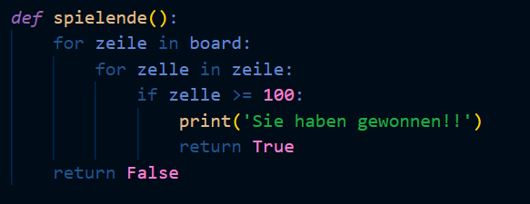

# Finaler Blog-Beitrag #

## Ziel des Spiels

Unterhaltung, das finale Ziel ist es, 2048 Punkte zu erreichen. 
Das geht dadurch, dass die Zahlen immer adddiert werden wenn sie angeklickt werden. 
Mit etwas strategie kann man die immer höheren Zahlen addieren. 

## Voraussetzung: 
Was muss ich installieren, um das Spiel zu starten?
Python (version 3.1) Damit der syntax funktioniert
vs code, damit man eine gute Darstellung hat
## Aktualisiertes Top-Down-Diagramm
 für das Spiel mit den von Ihnen geschriebenen Funktionen und deren Zusammenspiel.

## Erklärung eines algorithmischen Konzepts, das Sie in Ihrem Spiel verwendet haben
In meinem spiel habe ich das Ende so definiert, dass man gewonnen hat wenn man auf einem Feld hundert erreicht hat

## Grösste Herausforderungen
Obschon wir sehr viel unterstützung und Beispiel-codes zur verfügung hatten, war unsere eigene Kreativität und know-how gefragt und da dies nicht immer vorhanden war, habe ich viel unterstützung gebraucht vom Lehrer und verschiedenen Kollegen, die mehr erfahrung haben als ich.
(Das zurechtfinden mit den verschiedenen Tools ging sehr schnell.)
## Tipps 
(für andere EF-Schüler:innen, die das Spiel auch umsetzen möchten)
Ungeniert Fragen stellen und mit mitschüler:innen austauschen für individuelle Lösungs-ansätze
## Allenfalls Link zum Spiel