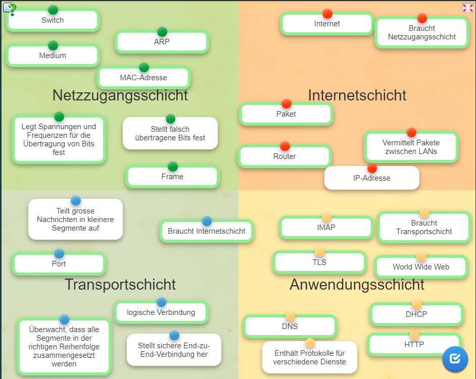
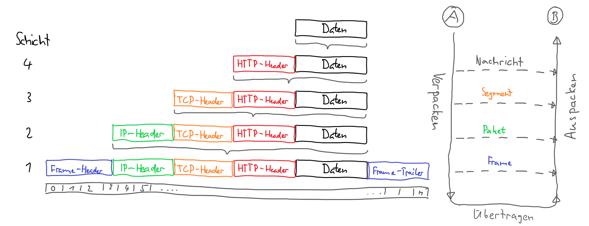

# Kapitel 3-8

## 3. Vom LAN zum Internet
Das Schulhausnetzwerk ist ein LAN (Local Area Network)
Das Telefonnetzwerk ist ein WAN (Wide Area Network)

Netzwerke: Gruppe von Hosts, die ähnliche ansprüche haben. 
Topologien : Je nach Art der Verbindung zum Medium entsteht eine andere Topologie.

-> Bus: "serieschaltung" der Komputer

-> Stern - switch: Bei dieser Topologie sind alle Computer durch ein zentrales Gerät verbunden.

Router: verbinden verschiedene LAN's miteinander. Oft benutzt man geräte, die switch und ein router zugleich sind.

Hosts sind allgemein geräte, die nachrichten senden und empfangen.

Gateway

## 4. IP-Adressen
* Nertwerkteil
        
    Vorderer Teil der IP-Adresse.
    Er ist für alle Geräte im selben Netzwerk gleich und entspricht der Grundadresse von allen Geräten, welche sich in diesem Netzwerk befinden.
* Hostteil

    Hinterer Teil der IP-Adresse.
    Er ist für jedes Gerät (auf englisch Host genannt) unterschiedlich. Es dürfen keine zwei Geräte im selben Netz den selben Hostteil in ihrer IP-Adresse aufweisen.

Diese Netzmaske sieht zunächst wie eine IP-Adresse aus, d.h. sie besteht auch aus vier Zahlen von je einem Byte Länge.

Ergänzt man den Netzwerkteil mit lauter 0 zu einer vollen 32 Bit langen IP-Adresse, so erhält man die Netzwerkadresse.

Die Netzwerkadresse wird gebraucht, wenn mehrere Netzwerke miteinander über Router verbunden werden. Sie darf nicht als IP-Adresse für ein einzelnes Gerät verwendet werden!

Auch bei den IP-Adressen gibt es Broadcastadressen (wie bei den MAC-Adressen). Sie werden gebraucht, wenn ein IP-Paket an alle Geräte innerhalb eines Netzwerkes gesendet werden sollen. Im Unterschied zur MAC-Adresse kann man aber auch ein IP-Paket an alle Geräte in einem anderen Netzwerk, als dem eigenen senden.

Pakete aus dem Internet für den Weitertransport im privaten Netzwerk erhalten eine private IP-Adresse.

## 5. Schichtenmodell
OSI model
networking is divided in 7 layers. they all have to work simultaneously so two hosts can share data.
* physisch/Netzzugangsschicht: etwas muss die Bits transportieren. alles, dass dabei hilft, bits zu transportieren, gehört zur ersten schicht. Wi-Fi gehört auch zu dieser Kategorie. auch repeaters und hubs gehören dazu. 
* Data Link/Internet-Schicht: Etwas, dass bits verschickt und annimmt. es interagiert mit den bits. z.B switchh oder Internet geräte.
* end to end/Network: jeder host hat eine eigene IP adresse. damit kann data an spezifische Geräte geschickt werden kann.
MAC-Adresse
diese Adresse besitzt nicht die IP adresse, sondern lediglich eine Information wo die data gerade war und wo sie als nächstes hin muss. also nicht anfangs- und endadresse, sondern schritt für schritt. diese wird dann auch verändert, wenn die data durch das Internet "saust". MAC-Adressen sind 6 Bytes lang und werden normalerweise in hexadezimaler Form geschrieben.
ARP: dieses Konzept verbindet MAC und IP-adressen zu einem adressen-paket.

 Der Sender sendet zuerst eine Nachricht an alle mit der Frage, wer eine bestimmte IP-Adresse hat und welche MAC-Adresse dazu gehört. Der betroffene Empfänger meldet sich dann und gibt seine MAC-Adresse bekannt.
DNS: macht aus einem Domain-namen eine IP-adresse
* transport: hat auch eine eigene Art adressen-art. jede art data wird mit einer art Identifizierung ausgestattet, damit man weis was für eine Art data das ist. TCP ist auf vertraulichkeit basiert und UDP auf effizienz
* anwendungsschicht
spezialisierte Protokolle für bestimmte Anwendungen. wie z.B. TLS füs security (z.B. HTTPS)

Kapselung

## 6. Netzwerkzugangsschicht

Was für Schritte braucht es, um zu Kommunizieren?
* Szenario 1

    Die beiden Computer sind im Gleichen Netzwerk und direkt miteinander verbunden (es könnten auch ein oder mehrere switches dazwischen sein aber auch in diesem Fall macht der Host dasselbe)

    Was Host A wissen muss, um daten zu senden: 
    
    IP-adresse(Kann durch DNS oder ping herausgefunden werden)

    Mac-adresse(kann mit einem ARP-request herausgefunden werden)

    Vom Empfänger werden dann die verschiedenen schichten und die gesendeten datenn verarbeitet 

    Die daten können sehr einfach beantwortet werden, da das ARP-verfahren alle Informationen des anderen Hosts gespeichert hat.
* Szenario 2

    Die beinden Computer sind nicht direkt, sondern durch einen (oder mehrere) Router verbunden.

    Was Host A wissen muss:
    IP-adresse vom Empfänger (Kann durch DNS oder ping herausgefunden werden)
    
    IP-adresse vom Router (ist schon als Default Gateway gespeichert worden, als der Computer mit dem Internet verbunden wurde.)

    MAC-adresse vom Router (mit ARP-request)

    wenn Host A diese Informationen gesammelt hat, sendet er die daten an den Router.

    Was der Router nun wissen muss:

    die IP- und MAC-Adresse der nächsten Router und Hosts. Dieser Prozess wird wiederholt, bis die daten am Ziel sind.

Mac-Tabelle

Routing-Tabelle
Ethernet-Frame