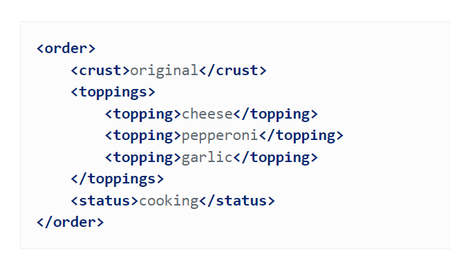
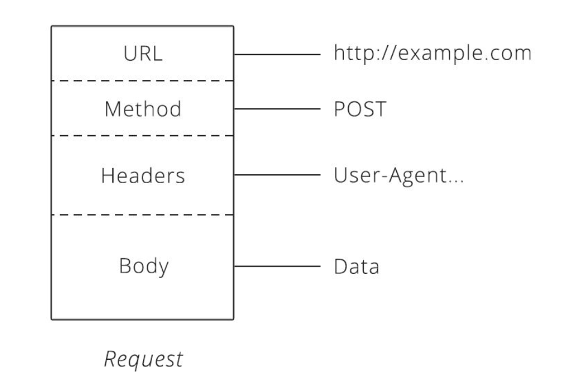

# Cheat-sheet ##

### What is an API?
APIs (application programming interfaces)

An API is the tool that makes a website's data digestible for a computer. Through it, a computer can view and edit data, just like a person can by loading pages and submitting forms. APIs make it easy to share data between two systems.

API is provided by the server.

When one site pulls in data from the other, the site providing the data is acting as the server, and the site fetching the data is the client.

### JSON Format (JavaScript Object Notation)

List with values that have names

JSON is a very simple format that has two pieces:
* Key: an attribute about an object (size, toppings...)
* Value: the value of an attribute (small, pepperoni...)

### XML Format (Extensible Markup Language)

XML always starts with a root node inside the order are more "child" nodes. 

The XML format requires a lot more text to communicate than JSON does.
### HTTPS

This works the same as HTTP. The difference being the S standing for secure.
### HTTP Request:
Communication in HTTP centers around a concept called the Request-Response Cycle. The client sends the server a request to do something. The server, in turn, sends the client a response saying whether or not the server could do what the client asked.

The client has to include the following things:
  * URL

    A unique address for a thing. official name: resource

    Url's are a easy way for the cloent to tell the server which thin it wants to interact with.
  * Methods

    GET - Asks the server to retrieve a resource

    POST - Asks the server to create a new resource. They always have a body & headers (as described below)

    PUT - Asks the server to edit/update an existing resource. The entire resource gets changed.
    
    DELETE - Asks the server to delete a resource

  * Headers

    They provide meta-information about a request. They are a simple list of items like the time the client sent the request and the size of the request body.
  * Body

    The request body contains the data the client wants to send the server. This is the only part of the request the client has complete control over .

The response headers and body follow the same format as requests.
### HTTP Status Codes

Status codes are three-digit numbers that each have a unique meaning. When used correctly in an API, this little number can communicate a lot of info to the client. For example, you may have seen this page during your internet wanderings.
### Polling
Polling is a way to keep the client updated about what is happening on the website or with the data they requested.
The more frequently the client makes requests (polls), the closer the client gets to real-time communication.

An API defines endpoints so the https so they lead the client to the right address.