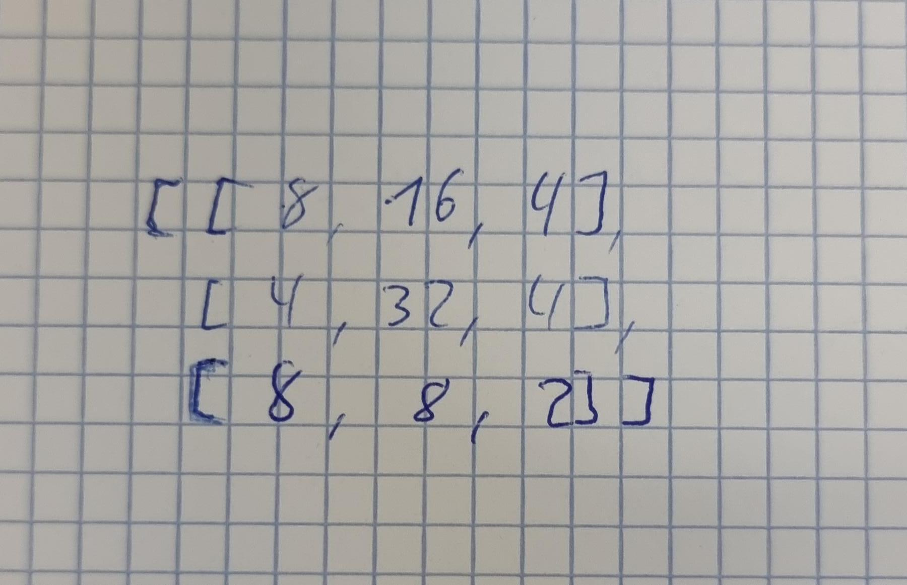

# Datenstruktur für das Spielfeld

Tiptop, das sollte geklappt haben 
danke vielmal

gerne. gibt es noch weitere Dinge, die Sie fragen wollten?

könnten sie mir zeigen wie man das bild wechseln kann?(der kleine dinosaurier auf der webseite)

Ja, es gibt zwei Bilder, die Sie tauschen müssen:
1. für das Logo:
    --> static/img/logo.svg durch Ihr Bild ersetzen. Falls es kein `.svg` ist, muss dies im [docusaurus.config.js](/docusaurus.config.js) verändert werden:
    dort statt `img/logo.svg` bspw. `img/logo.png` hinschreiben.

2. für das kleine Logo im Tab:
    --> das static/img/favicon.ico ersetzen. Das muss dieses spezielle Format haben - Sie müssen ein Bild mit einer Webseite umwandeln: bspw. mit https://convertio.co/png-ico/ 

Verständlich?
ja, danke nochmals:)
Gerne :)
Wenn etwas anderes noch auftaucht, gerne melden ;)